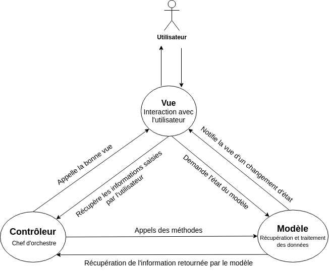
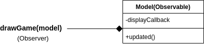

# ISI3 - MVP design pattern - "Game of Life"

> Le rapport est à fournir dans ce document sous chacune des questions. 
> **Ne restez pas bloqués bêtement, demander de l'aide**
> Ne copier pas le code de votre voisin, ça se voit.

Nom/Prénom: Cécile Besson

Lien du codesandbox: https://codesandbox.io/s/github/PolytechLyon/2020-isi3-mvc-CecileBesson

> Pour générer un codesandbox associé à votre code, [suiver cette doc](https://codesandbox.io/docs/importing#import-from-github)

## Game of Life

Le jeu de la vie est un automate cellulaire qui répond à des règles très simple.
Il est inventé par [John Horton Conway](https://fr.wikipedia.org/wiki/John_Horton_Conway)(1937-2020).

## Avant-propos

1. Expliquer le design pattern MVC à l'aide d'un schéma à insérer directement ici. 
Utiliser un outils commde Dia pour le représenter. Je veux **votre** schéma, pas un de ceux qu'on peut trouver sur le net.

2. Expliquer ce pattern en complétant ce texte.

Le pattern MVC, vise à découper le modèle, de la vue et du controleur afin de rendre le code plus modulaire .
Les responsabilités ne sont alors plus groupées.
On peut ainsi changer l'aspect visuel de son application sans pour autant impacter le modèle.

3. Expliquer dans quels cas on doit privilégier le pattern MVC.

Le pattern mvc est beaucoup utilisé pour les applications web. Il est à privilégier si l'on souhaite 
séparer l'affichage des informations, l'accès aux données et les actions de l'utilisateur.
L'utilisation du pattern mvc permet aussi de simplifier les opérations de maintenance puisque les responsabilités sont
découpées. Il permet aussi de répartir plus facilement les tâches entre les développeurs. 
## A faire (obligatoire)

- Render le jeu fonctionel tout en respectant le design pattern MVC.
- Le bouton `start` doit lancer le jeu.
- Le bouton `stop` doit arrêter le jeu en l'état, le `start` relance le jeu.
- le bouton `reset` arrête le jeu et vide remet à la grille à l'état initiale.

### Observer Observable

Afin de mettre à jour la vue à chaque nouvelle génération du jeu, la fonction `updated` doit notifier la view afin qu'elle se mette à jour.
En quoi cela relève du design pattern ObserverObservable.

1. Expliquer votre implémentation:

L'usage d'une callback permet ici de pointer vers la fonction d'affichage afin dire à la _View_ de se redessiner.
L'objet _Model_ n'a pas de lien avec la vue pourtant grâce à la fonction callback il peut notifier la `vue.

2. Insérer ici un UML montrant le pattern Observer-Observable liés aux objects de ce TP.

La classe Model possède un attribut displayCallback qui pointe vers la fonction à appeler, ici drawGame().
Ici la fonction drawGame joue directement le rôle d'observeur, elle est directement appelée par updated().

## Optionel

> Si vous voulez apprendre d'autres choses

- Faire sorte de pouvoir changer les dimensions de la grille par in `<input/>` HTML.
- Faire en sorte de pouvoir modifier l'état d'une cellule en cliquant dessus.

## :warning: À rendre

- Une URL de codesandox pointant sur votre projet github afin que je puisse voir et tester le code.
- Le rapport complet.
